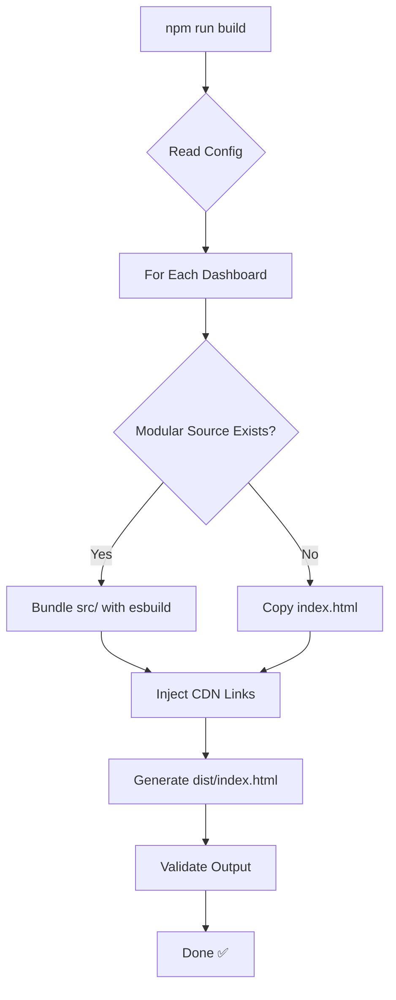

# Centralized Build System - Implementation Summary

> Historical implementation note: this file is an implementation snapshot from 2024-03-25. For the current build reference, use [BUILD-SYSTEM.md](BUILD-SYSTEM.md).

**Date:** 2024-03-25  
**Status:** ✅ Complete - Centralized build infrastructure established

## What Was Built

### 1. Centralized Build Scripts (`scripts/`)

| Script | Purpose | Usage |
|--------|---------|-------|
| `build-dashboard.js` | Build single dashboard | `node scripts/build-dashboard.js <path>` |
| `build-all.js` | Build all dashboards | `npm run build` |
| `validate-structure.js` | Validate dashboard structure | `npm run validate` |
| `verify-all-calculations.js` | Run all verification scripts | `npm run verify:all` |

### 2. Central Configuration (`build-config/`)

**`dashboard-config.js`** defines:
- Common settings (CDN links, externals, output format)
- Dashboard-specific configs (paths, entry points, templates)
- Validation rules (required files, test coverage)
- Color theme (GitHub dark mode)

**Enforces consistency:**
- All dashboards use same React, Highcharts, Primer CSS versions
- Same build output format (minified IIFE)
- Same validation requirements
- Same external dependencies (never bundled)

### 3. Root Package Configuration

**`package.json`** with npm workspaces:
```json
{
  "workspaces": [
    "BVE-dashboards-for-ai-assisted-coding",
    "BVE-dashboards-for-agentic-ai-coding"
  ]
}
```

**Centralized scripts:**
- `npm run build` - Build all dashboards
- `npm test` - Run all tests
- `npm run validate` - Validate all structures
- `npm run verify:all` - Verify all calculations

### 4. Documentation

- **`README.md`** (root) - Repository overview, quick start, architecture
- **`docs/BUILD-SYSTEM.md`** - Detailed build documentation
- **`.gitignore`** - Consistent ignore rules across repo

## Build Process Flow



## Key Design Decisions

### 1. Gradual Migration Support

**Problem:** Can't refactor all dashboards at once  
**Solution:** Fallback to copy `index.html` if modular source doesn't exist

**Benefits:**
- ✅ All dashboards work immediately
- ✅ Can migrate one at a time
- ✅ No deployment risk
- ✅ Build system ready before migration

### 2. External Dependencies via CDN

**What's External:**
- React 18 (UMD production)
- React DOM 18 (UMD production)  
- Highcharts 11.4.8 + Accessibility
- Primer CSS 21.3.1

**Benefits:**
- ✅ Smaller bundle size (only app code)
- ✅ Browser caching across dashboards
- ✅ Consistent versions
- ✅ Fast build times

### 3. Single Configuration Source

**`build-config/dashboard-config.js`** is the **single source of truth**

**Adding a dashboard:**
1. Add entry to `dashboardConfig.dashboards`
2. Run `npm run validate`
3. Run `npm run build`

**No need to:**
- ❌ Copy build scripts
- ❌ Duplicate configuration
- ❌ Maintain multiple configs

### 4. npm Workspaces

**Structure:**
```
root/
├── package.json (workspaces defined)
├── BVE-dashboards-for-ai-assisted-coding/
│   └── package.json
└── BVE-dashboards-for-agentic-ai-coding/
    └── package.json
```

**Benefits:**
- ✅ `npm install --include=dev` at root installs all (including test frameworks)
- ✅ `npm test` runs all dashboard tests
- ✅ Shared devDependencies (less duplication)
- ✅ Consistent versions across workspaces

## Validation & Quality Assurance

### Structure Validation
```bash
npm run validate
```

**Checks:**
- Required directories (`src/`, `tests/`, `dist/`)
- Required files (`package.json`, `README.md`)
- Required scripts (`test`, `build`)
- Module extraction status
- Test file existence

### Calculation Verification
```bash
npm run verify:all
```

**Runs:**
- `verify_math.cjs` for each dashboard
- Validates calculation accuracy
- Compares estimation methods
- Outputs expected vs actual

### Test Execution
```bash
npm test
```

**Runs:**
- All Vitest tests across all dashboards
- Generates coverage reports
- Fails if coverage < 80%

## Repository Structure (After Implementation)

```
SDLC-BVE-dashboards-for-X/
├── scripts/                              # ✅ New - Centralized build
│   ├── build-dashboard.js               # Single dashboard builder
│   ├── build-all.js                     # Batch builder
│   ├── validate-structure.js            # Structure validator
│   └── verify-all-calculations.js       # Calculation verifier
├── build-config/                         # ✅ New - Central config
│   └── dashboard-config.js              # All dashboard configs
├── docs/                                 # ✅ New - Documentation
│   └── BUILD-SYSTEM.md                  # Build system docs
├── BVE-dashboards-for-ai-assisted-coding/
│   ├── dashboard/
│   │   ├── efficiency/                  # ✅ Migrated
│   │   │   ├── src/                     # Modular source
│   │   │   ├── tests/                   # Unit tests
│   │   │   ├── dist/                    # Build output
│   │   │   ├── index.html               # Original
│   │   │   └── package.json             # Dashboard package
│   │   └── structural/                  # 🔄 Ready for migration
│   ├── data/
│   │   ├── queries/                     # Data collection
│   │   ├── schemas/                     # JSON schemas
│   │   └── examples/                    # Sample data
│   └── README.md
├── BVE-dashboards-for-agentic-ai-coding/ # 🔄 Ready for migration
├── package.json                          # ✅ New - Root with workspaces
├── README.md                             # ✅ Updated
└── .gitignore                            # ✅ New
```

## Usage Examples

### Build Single Dashboard
```bash
npm run build:ai-assisted
# Output: BVE-dashboards-for-ai-assisted-coding/dashboard/efficiency/dist/index.html
```

### Build All Dashboards
```bash
npm run build
# Builds all configured dashboards
```

### Validate Everything
```bash
npm run validate
# Checks structure of all dashboards
```

### Run All Tests
```bash
npm test
# Runs tests in all workspaces
```

### Verify Calculations
```bash
npm run verify:all
# Runs verify_math.cjs for all dashboards
```

## Integration with Migration Process

### Before (No Build System)
1. Copy monolithic HTML
2. Manually extract logic
3. Hope calculations match
4. No way to validate

### After (With Build System)
1. Configure dashboard in `dashboard-config.js`
2. Extract modules to `src/`
3. Write tests
4. Run `npm test` - validates logic
5. Run `npm run build` - generates new HTML
6. Run `npm run verify:all` - validates calculations
7. Compare original vs built output

## Benefits Achieved

### 🎯 Consistency
- ✅ All dashboards built the same way
- ✅ Same CDN versions
- ✅ Same validation rules
- ✅ Same output format

### 🧪 Quality Assurance
- ✅ Automated validation
- ✅ Calculation verification
- ✅ Test coverage requirements
- ✅ Structure enforcement

### 🚀 Productivity
- ✅ One command builds all
- ✅ One command validates all
- ✅ One command tests all
- ✅ Clear error messages

### 📦 Maintainability
- ✅ Single source of truth (config)
- ✅ Easy to add dashboards
- ✅ Easy to update dependencies
- ✅ Clear documentation

### 🔄 Migration Support
- ✅ Works with monolithic HTML
- ✅ Works with modular source
- ✅ Gradual migration enabled
- ✅ No breaking changes

## Next Steps

### For AI Assisted Coding - Efficiency
1. ✅ Core modules extracted
2. ✅ Tests written
3. ⏳ Extract React components
4. ⏳ Create template.html
5. ⏳ Create main.js entry point
6. ⏳ Test build process
7. ⏳ Validate output

### For Other Dashboards
1. ⏳ Add to `dashboard-config.js`
2. ⏳ Create directory structure
3. ⏳ Extract core logic
4. ⏳ Write tests
5. ⏳ Build and validate

## Configuration Reference

### Adding a New Dashboard

1. **Edit `build-config/dashboard-config.js`:**
```javascript
dashboards: {
  'my-new-dashboard': {
    path: 'BVE-dashboards-for-*/dashboard/my-dashboard',
    name: 'My New Dashboard',
    entry: 'src/main.js',
    template: 'src/template.html',
    output: 'dist/index.html',
    dataSchema: '../../data/schemas/my-schema.json',
    exampleData: '../../data/examples/my-example.json',
    modules: [
      'src/core/calculator.js',
      'src/core/processor.js'
    ]
  }
}
```

2. **Create directory structure:**
```bash
mkdir -p BVE-dashboards-for-*/dashboard/my-dashboard/{src,tests,dist}
```

3. **Add workspace to root `package.json`:**
```json
"workspaces": [
  "BVE-dashboards-for-ai-assisted-coding",
  "BVE-dashboards-for-my-new-area"
]
```

4. **Validate:**
```bash
npm run validate
```

## Success Metrics

- ✅ **All scripts executable** - chmod +x applied
- ✅ **Central config created** - Single source of truth
- ✅ **Documentation complete** - BUILD-SYSTEM.md + README.md
- ✅ **Workspace setup** - Root package.json with workspaces
- ✅ **Validation ready** - Can check all dashboards
- ✅ **Build ready** - Can build with fallback
- ✅ **Verification ready** - Can run verify_math.cjs

## Conclusion

The centralized build system provides a **consistent, validated, and maintainable** foundation for all BVE dashboards. It supports both existing monolithic dashboards and modular source, enabling gradual migration without deployment risk.

**Key Achievement:** Any dashboard can now be built, tested, validated, and verified using the same commands and configuration.
